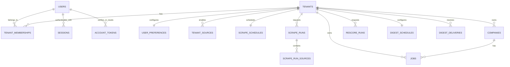

# Multi-User and Tenant Architecture Plan

## Status

This document is the implementation blueprint for moving `opportunity-radar` from a
single-user application to an openly registered, multi-user application.

It supersedes the earlier version of this document. In particular, the earlier plan
assumed that jobs and companies would be global records shared by all users. That is
no longer the desired product model.

This is an architecture and implementation plan, not a completed implementation.
When implementation starts, agents should follow the phases and invariants in this
document rather than attempting the entire transition in one migration or one large
refactor.

The priorities are:

1. Correct tenant isolation.
2. A safe migration path for existing single-user data.
3. Durable, user-controlled scraping schedules and manual runs.
4. Fast tenant-specific scoring and digest queries.
5. Retaining the current single-Go-service and server-rendered-HTML approach until
   there is a concrete reason to change either.

---

## 1. Decisions at a Glance

The following decisions are settled for the first multi-user version.

| Area | Decision |
|---|---|
| Registration | Open registration: anyone may create an account |
| Account verification | Email verification is required before scheduled scraping or email delivery |
| Authentication | Email/password authentication with database-backed cookie sessions |
| Tenant model | Users and tenants are separate concepts; a new registration creates one tenant and one owner membership |
| Teams | The schema permits multiple members, but team-management features are out of scope initially |
| Jobs | Tenant-owned, not globally shared |
| Companies | Tenant-owned, not globally shared |
| Job uniqueness | Scoped by tenant and source |
| Company matching | Performed only inside the active tenant |
| Scoring | Push-based stable relevance scoring during ingestion |
| Freshness | Applied at query/digest time rather than persisted inside the stable relevance score |
| Rescoring | Asynchronous, tenant-scoped rescore after scoring preferences change |
| Scrape schedules | Controlled by each tenant and persisted in PostgreSQL |
| Manual scraping | `Run Once` creates an asynchronous, durable scrape run |
| Scrape execution | Tenant-scoped on-demand execution with platform-wide concurrency and rate controls |
| Digest scheduling | Separate from scraping schedules |
| Outgoing email credentials | One application-owned provider configuration |
| Digest recipient | Defaults to account email; an alternate address must be verified |
| UI technology | Continue with server-rendered HTML for the first implementation |
| Deployment shape | Continue with one Go service and PostgreSQL initially |

These decisions deliberately optimize for clear ownership and correctness rather
than eliminating duplicate rows or duplicate source requests at the earliest stage.

---

## 2. Terminology

### User

A user is a login identity. A user owns credentials, sessions, email verification
state, and password-reset state.

Users are global identities and are not themselves the tenancy boundary.

### Tenant

A tenant is the ownership and data-isolation boundary. Preferences, companies, jobs,
scraper configuration, scrape runs, scores, and digests belong to a tenant.

For the first release, normal registration creates:

- one user;
- one tenant;
- one owner membership connecting them.

Keeping tenant identity separate from user identity avoids another disruptive schema
change if teams or organizations are added later.

### Membership

A membership connects a user to a tenant and gives the user a role in that tenant.
Initially only the `owner` role needs to be usable. The schema may permit `member`
for future work, but member invitations and role management are not part of the
first implementation.

### Tenant context

Tenant context is the authenticated tenant identity carried through an HTTP request
or background operation. It is not a tenant ID accepted blindly from form input.

### Platform configuration

Platform configuration is deployment-owned configuration such as database
credentials, session cookie security, global scraper concurrency, source kill
switches, and the email provider API key.

### Tenant configuration

Tenant configuration expresses user intent: profile/scoring preferences, enabled
sources, scrape frequency, digest schedule, and digest recipient.

---

## 3. Non-Negotiable Architecture Invariants

These invariants are more important than individual type or table names.

### 3.1 Tenant isolation

1. Every tenant-owned table has a non-null `tenant_id`.
2. Every repository method that reads or mutates tenant-owned data accepts
   `tenantID`.
3. Queries filter by tenant in SQL. Loading a record globally and checking its tenant
   later in Go is not sufficient.
4. IDs received from URLs, forms, or JSON never establish tenant context.
5. The authenticated membership establishes the active tenant.
6. Cross-table references cannot connect records from different tenants.
7. Unique constraints for tenant-owned identities include `tenant_id`.
8. Logs for tenant work include `tenant_id` and, where relevant, `run_id` and
   `source`, but never session tokens, password-reset tokens, or email-provider
   secrets.

### 3.2 Background work

1. Scheduled and manual work is represented durably in PostgreSQL.
2. An HTTP request does not perform a complete scrape inline.
3. A process restart must not silently lose an accepted manual run.
4. Workers claim work atomically.
5. Work is idempotent or protected by tenant-scoped uniqueness constraints.
6. A failed source does not erase the results of another successful source.
7. Per-source and global limits are enforced independently of tenant preferences.

### 3.3 Authentication and secrets

1. Passwords are stored only as password hashes.
2. Usable session and one-time tokens are never stored in plaintext.
3. Authentication cookies are `HttpOnly`, `Secure` in production, and
   `SameSite=Lax` or stricter.
4. Authentication state is rotated after login and password changes.
5. Email-provider credentials remain platform secrets and are never stored in tenant
   preferences.

### 3.4 Scoring

1. Persisted relevance is based only on stable job content and the tenant's scoring
   profile.
2. Time-dependent freshness is not baked permanently into stable relevance.
3. Stored scores record the profile version that produced them.
4. Updating scoring preferences increments the profile version transactionally and
   schedules a rescore.
5. A rescore affects only the tenant that changed its preferences.

---

## 4. Why Jobs and Companies Are Tenant-Owned

The application is moving toward supporting opportunities outside technology. Two
users may care about entirely different sources, sectors, roles, and companies.
Companies discovered for one user's search are not automatically useful to another
user.

Tenant ownership provides:

- straightforward privacy and deletion semantics;
- company identity rules that reflect the tenant's own collected data;
- simple job scoring, because each job has one relevant profile at ingestion time;
- easy tenant export and account deletion;
- freedom to add tenant-specific notes, status, or outreach data later;
- fewer accidental information leaks through list, detail, digest, or company
  endpoints.

The primary cost is duplication. The same external job or company may be stored for
multiple tenants. This is accepted for the initial version. Database storage is
expected to be cheaper and easier to manage than a shared-domain model with
per-tenant visibility, ownership, scoring, deletion, and lifecycle rules.

Scraper network traffic, rather than row duplication, is the likely scaling
constraint. Section 12 describes guardrails and a future acquisition-cache option.

---

## 5. Target Domain Model



The names may be adjusted to match package terminology, but ownership and
relationships must remain equivalent.

---

## 6. Target Database Design

The SQL below is illustrative target DDL. Implementation must use timestamped
up/down migrations and follow the staged migration procedure in Section 16.
Do not paste this entire section into one production migration.

### 6.1 Tenants, users, and memberships

```sql
CREATE TABLE tenants (
    id BIGSERIAL PRIMARY KEY,
    name TEXT NOT NULL,
    created_at TIMESTAMPTZ NOT NULL DEFAULT NOW(),
    updated_at TIMESTAMPTZ NOT NULL DEFAULT NOW()
);

CREATE TABLE users (
    id BIGSERIAL PRIMARY KEY,
    email TEXT NOT NULL,
    password_hash TEXT NOT NULL,
    email_verified_at TIMESTAMPTZ,
    disabled_at TIMESTAMPTZ,
    created_at TIMESTAMPTZ NOT NULL DEFAULT NOW(),
    updated_at TIMESTAMPTZ NOT NULL DEFAULT NOW(),
    CONSTRAINT users_email_normalized CHECK (email = LOWER(BTRIM(email))),
    CONSTRAINT users_email_unique UNIQUE (email)
);

CREATE TABLE tenant_memberships (
    tenant_id BIGINT NOT NULL REFERENCES tenants(id) ON DELETE CASCADE,
    user_id BIGINT NOT NULL REFERENCES users(id) ON DELETE CASCADE,
    role TEXT NOT NULL CHECK (role IN ('owner', 'member')),
    created_at TIMESTAMPTZ NOT NULL DEFAULT NOW(),
    PRIMARY KEY (tenant_id, user_id)
);

CREATE INDEX tenant_memberships_user_id_idx
    ON tenant_memberships(user_id);
```

Registration creates the user, tenant, owner membership, default preferences,
default source settings, scrape schedule, and digest schedule in one database
transaction. Partial registration must roll back.

Although the schema permits multiple memberships, tenant switching and invitations
are deferred. If a user somehow has multiple memberships before switching is
implemented, the application must choose only through a server-controlled rule and
must never accept an arbitrary unverified tenant ID.

### 6.2 Sessions

```sql
CREATE TABLE sessions (
    id BIGSERIAL PRIMARY KEY,
    user_id BIGINT NOT NULL REFERENCES users(id) ON DELETE CASCADE,
    token_hash BYTEA NOT NULL UNIQUE,
    expires_at TIMESTAMPTZ NOT NULL,
    last_seen_at TIMESTAMPTZ NOT NULL DEFAULT NOW(),
    created_at TIMESTAMPTZ NOT NULL DEFAULT NOW()
);

CREATE INDEX sessions_user_id_idx ON sessions(user_id);
CREATE INDEX sessions_expires_at_idx ON sessions(expires_at);
```

Generate at least 32 random bytes for the cookie token. Store a SHA-256 hash of the
token in `token_hash`; the high-entropy token does not require a slow password hash.
Only the raw token goes into the cookie.

Session cleanup can initially be a periodic `DELETE WHERE expires_at < NOW()`.

### 6.3 Verification and password-reset tokens

```sql
CREATE TABLE account_tokens (
    id BIGSERIAL PRIMARY KEY,
    user_id BIGINT NOT NULL REFERENCES users(id) ON DELETE CASCADE,
    purpose TEXT NOT NULL CHECK (purpose IN ('verify_email', 'reset_password')),
    token_hash BYTEA NOT NULL UNIQUE,
    target_email TEXT,
    expires_at TIMESTAMPTZ NOT NULL,
    consumed_at TIMESTAMPTZ,
    created_at TIMESTAMPTZ NOT NULL DEFAULT NOW()
);

CREATE INDEX account_tokens_user_purpose_idx
    ON account_tokens(user_id, purpose);
CREATE INDEX account_tokens_expires_at_idx
    ON account_tokens(expires_at);
```

The raw token is emailed and never persisted. Consuming a token must atomically
verify its hash, purpose, expiry, and unused state, then set `consumed_at`.

`target_email` supports future email-address changes. It may be null for password
resets.

### 6.4 Tenant preferences

The existing `app_settings` row becomes one preferences row per tenant.

```sql
CREATE TABLE user_preferences (
    tenant_id BIGINT PRIMARY KEY REFERENCES tenants(id) ON DELETE CASCADE,
    setup_complete BOOLEAN NOT NULL DEFAULT FALSE,

    desired_roles TEXT[] NOT NULL DEFAULT '{}',
    experience_level TEXT NOT NULL DEFAULT '',
    current_skills TEXT[] NOT NULL DEFAULT '{}',
    growth_skills TEXT[] NOT NULL DEFAULT '{}',
    locations TEXT[] NOT NULL DEFAULT '{}',
    work_modes TEXT[] NOT NULL DEFAULT '{}',
    avoid_terms TEXT[] NOT NULL DEFAULT '{}',

    role_keywords TEXT[] NOT NULL DEFAULT '{}',
    skill_keywords TEXT[] NOT NULL DEFAULT '{}',
    preferred_level_keywords TEXT[] NOT NULL DEFAULT '{}',
    penalty_level_keywords TEXT[] NOT NULL DEFAULT '{}',
    preferred_location_terms TEXT[] NOT NULL DEFAULT '{}',
    penalty_location_terms TEXT[] NOT NULL DEFAULT '{}',
    mismatch_keywords TEXT[] NOT NULL DEFAULT '{}',

    scoring_profile_version BIGINT NOT NULL DEFAULT 1,
    created_at TIMESTAMPTZ NOT NULL DEFAULT NOW(),
    updated_at TIMESTAMPTZ NOT NULL DEFAULT NOW()
);
```

The product-facing fields and derived keyword fields are retained because the
current application maps friendlier setup inputs into scorer inputs. That mapping
remains in the preferences domain.

Digest settings and scraper schedules should move out of this table. They have
different execution lifecycles and should not remain coupled to profile settings.

The package may remain named `preferences`, even though the database table uses a
tenant ID. Avoid naming the model `UserPreferences` in Go if that encourages callers
to pass `userID` where `tenantID` is required.

### 6.5 Tenant-owned companies

```sql
ALTER TABLE companies ADD COLUMN tenant_id BIGINT;
```

After backfill, make it non-null and add:

```sql
ALTER TABLE companies
    ALTER COLUMN tenant_id SET NOT NULL,
    ADD CONSTRAINT companies_tenant_fk
        FOREIGN KEY (tenant_id) REFERENCES tenants(id) ON DELETE CASCADE,
    ADD CONSTRAINT companies_id_tenant_unique UNIQUE (id, tenant_id);

CREATE INDEX companies_tenant_name_idx
    ON companies(tenant_id, name);

CREATE INDEX companies_tenant_domain_idx
    ON companies(tenant_id, domain)
    WHERE domain <> '';

CREATE INDEX companies_tenant_source_external_idx
    ON companies(tenant_id, source, external_id)
    WHERE source <> '' AND external_id <> '';
```

Company lookup order remains:

1. `(tenant_id, source, external_id)` when both identity fields exist;
2. `(tenant_id, domain)` when a reliable domain exists;
3. normalized name within the tenant;
4. create a new tenant-owned company.

Do not match companies across tenants.

The existing sentinel/unknown-company behavior must also become tenant-safe. A
global company ID such as `0` cannot be referenced by all tenants while enforcing
tenant consistency. Prefer one tenant-owned `"Unknown"` company created lazily or
during tenant creation. Its identity must be unique within that tenant.

### 6.6 Tenant-owned jobs

```sql
ALTER TABLE jobs
    ADD COLUMN tenant_id BIGINT,
    ADD COLUMN relevance_score DOUBLE PRECISION,
    ADD COLUMN scoring_profile_version BIGINT;
```

After backfill:

```sql
ALTER TABLE jobs
    ALTER COLUMN tenant_id SET NOT NULL,
    ALTER COLUMN relevance_score SET NOT NULL,
    ALTER COLUMN scoring_profile_version SET NOT NULL,
    ADD CONSTRAINT jobs_tenant_fk
        FOREIGN KEY (tenant_id) REFERENCES tenants(id) ON DELETE CASCADE,
    ADD CONSTRAINT jobs_company_same_tenant_fk
        FOREIGN KEY (company_id, tenant_id)
        REFERENCES companies(id, tenant_id)
        ON DELETE CASCADE;

ALTER TABLE jobs DROP CONSTRAINT unique_source_url;
ALTER TABLE jobs
    ADD CONSTRAINT jobs_tenant_source_url_unique
    UNIQUE (tenant_id, source, url);

CREATE INDEX jobs_tenant_score_idx
    ON jobs(tenant_id, relevance_score DESC);

CREATE INDEX jobs_tenant_status_posted_idx
    ON jobs(tenant_id, status, posted_at DESC);

CREATE INDEX jobs_tenant_profile_version_idx
    ON jobs(tenant_id, scoring_profile_version);
```

Once code uses `relevance_score`, drop the old `score` column in a later cleanup
migration. Do not rename and reinterpret it in the same deploy that changes scoring
semantics unless code and migration compatibility are carefully coordinated.

The direct `jobs.tenant_id` is intentional even though a job can inherit tenancy
through its company:

- nearly every job query can filter without joining companies;
- indexes naturally begin with tenant identity;
- tenant deletion and auditing are explicit;
- the composite foreign key prevents a job from referencing another tenant's
  company.

### 6.7 Tenant sources

```sql
CREATE TABLE tenant_sources (
    tenant_id BIGINT NOT NULL REFERENCES tenants(id) ON DELETE CASCADE,
    source TEXT NOT NULL,
    enabled BOOLEAN NOT NULL DEFAULT TRUE,
    settings JSONB NOT NULL DEFAULT '{}'::jsonb,
    created_at TIMESTAMPTZ NOT NULL DEFAULT NOW(),
    updated_at TIMESTAMPTZ NOT NULL DEFAULT NOW(),
    PRIMARY KEY (tenant_id, source)
);
```

`source` must correspond to a scraper registered by the application. The service
must reject unknown source names.

`settings` is reserved for genuinely source-specific options. Common scheduling
fields do not belong in this JSON. Validate JSON in the source adapter before
saving it. Never place API credentials in this column without a separate encrypted
secret-management design.

### 6.8 Scrape schedules

The first version uses one automatic scrape cadence per tenant, with individual
sources enabled or disabled through `tenant_sources`.

```sql
CREATE TABLE scrape_schedules (
    tenant_id BIGINT PRIMARY KEY REFERENCES tenants(id) ON DELETE CASCADE,
    enabled BOOLEAN NOT NULL DEFAULT TRUE,
    interval_seconds BIGINT NOT NULL DEFAULT 86400,
    next_run_at TIMESTAMPTZ,
    last_enqueued_at TIMESTAMPTZ,
    created_at TIMESTAMPTZ NOT NULL DEFAULT NOW(),
    updated_at TIMESTAMPTZ NOT NULL DEFAULT NOW(),
    CHECK (interval_seconds > 0)
);

CREATE INDEX scrape_schedules_due_idx
    ON scrape_schedules(next_run_at)
    WHERE enabled = TRUE;
```

The service exposes a finite set of supported frequencies rather than arbitrary cron
expressions. Initially:

- 6 hours;
- 12 hours;
- 24 hours;
- 3 days;
- 7 days.

Disabling automation sets `enabled = FALSE` and `next_run_at = NULL`. It does not
disable Run Once.

Source-specific minimum intervals remain platform policy. A tenant cannot bypass a
source's minimum interval by choosing a faster general schedule.

### 6.9 Scrape runs and per-source attempts

```sql
CREATE TABLE scrape_runs (
    id BIGSERIAL PRIMARY KEY,
    tenant_id BIGINT NOT NULL REFERENCES tenants(id) ON DELETE CASCADE,
    trigger TEXT NOT NULL CHECK (trigger IN ('scheduled', 'manual')),
    status TEXT NOT NULL
        CHECK (status IN ('queued', 'running', 'completed', 'partial', 'failed', 'cancelled')),
    requested_by_user_id BIGINT REFERENCES users(id) ON DELETE SET NULL,
    available_at TIMESTAMPTZ NOT NULL DEFAULT NOW(),
    claimed_at TIMESTAMPTZ,
    heartbeat_at TIMESTAMPTZ,
    started_at TIMESTAMPTZ,
    completed_at TIMESTAMPTZ,
    error_message TEXT NOT NULL DEFAULT '',
    jobs_found INTEGER NOT NULL DEFAULT 0,
    jobs_saved INTEGER NOT NULL DEFAULT 0,
    jobs_skipped INTEGER NOT NULL DEFAULT 0,
    jobs_failed INTEGER NOT NULL DEFAULT 0,
    created_at TIMESTAMPTZ NOT NULL DEFAULT NOW()
);

CREATE INDEX scrape_runs_claim_idx
    ON scrape_runs(available_at, created_at)
    WHERE status = 'queued';

CREATE INDEX scrape_runs_tenant_created_idx
    ON scrape_runs(tenant_id, created_at DESC);

CREATE TABLE scrape_run_sources (
    run_id BIGINT NOT NULL REFERENCES scrape_runs(id) ON DELETE CASCADE,
    source TEXT NOT NULL,
    status TEXT NOT NULL
        CHECK (status IN ('queued', 'running', 'completed', 'failed', 'skipped')),
    started_at TIMESTAMPTZ,
    completed_at TIMESTAMPTZ,
    error_message TEXT NOT NULL DEFAULT '',
    jobs_found INTEGER NOT NULL DEFAULT 0,
    jobs_saved INTEGER NOT NULL DEFAULT 0,
    jobs_skipped INTEGER NOT NULL DEFAULT 0,
    jobs_failed INTEGER NOT NULL DEFAULT 0,
    PRIMARY KEY (run_id, source)
);
```

At enqueue time, snapshot the enabled sources into `scrape_run_sources`. A later
change to tenant source preferences must not silently change an already accepted
run.

Prevent overlapping active runs for a tenant with a partial unique index:

```sql
CREATE UNIQUE INDEX scrape_runs_one_active_per_tenant
    ON scrape_runs(tenant_id)
    WHERE status IN ('queued', 'running');
```

This is both a correctness rule and a Run Once cooldown mechanism. A second manual
request while a tenant run is queued or running returns the existing active run or a
domain conflict, rather than creating duplicate work.

If future requirements need simultaneous independent source runs, replace this
tenant-level constraint with per-tenant/per-source active constraints. Do not weaken
it preemptively.

### 6.10 Rescore runs

```sql
CREATE TABLE rescore_runs (
    id BIGSERIAL PRIMARY KEY,
    tenant_id BIGINT NOT NULL REFERENCES tenants(id) ON DELETE CASCADE,
    target_profile_version BIGINT NOT NULL,
    status TEXT NOT NULL
        CHECK (status IN ('queued', 'running', 'completed', 'failed', 'cancelled')),
    available_at TIMESTAMPTZ NOT NULL DEFAULT NOW(),
    started_at TIMESTAMPTZ,
    completed_at TIMESTAMPTZ,
    jobs_processed INTEGER NOT NULL DEFAULT 0,
    error_message TEXT NOT NULL DEFAULT '',
    created_at TIMESTAMPTZ NOT NULL DEFAULT NOW()
);

CREATE UNIQUE INDEX rescore_runs_one_active_per_tenant
    ON rescore_runs(tenant_id)
    WHERE status IN ('queued', 'running');
```

Repeated profile edits should coalesce. If a queued rescore exists, update its
`target_profile_version` to the newest version. If a rescore is already running,
ensure another queued run exists for the newer version or have the worker detect the
version change before completion.

### 6.11 Digest schedules

Scrape and digest scheduling are deliberately independent.

```sql
CREATE TABLE digest_schedules (
    tenant_id BIGINT PRIMARY KEY REFERENCES tenants(id) ON DELETE CASCADE,
    enabled BOOLEAN NOT NULL DEFAULT FALSE,
    recipient_email TEXT NOT NULL DEFAULT '',
    recipient_verified_at TIMESTAMPTZ,
    top_n INTEGER NOT NULL DEFAULT 10 CHECK (top_n > 0),
    lookback_seconds BIGINT NOT NULL DEFAULT 86400 CHECK (lookback_seconds > 0),
    interval_seconds BIGINT NOT NULL DEFAULT 86400 CHECK (interval_seconds > 0),
    next_run_at TIMESTAMPTZ,
    last_enqueued_at TIMESTAMPTZ,
    created_at TIMESTAMPTZ NOT NULL DEFAULT NOW(),
    updated_at TIMESTAMPTZ NOT NULL DEFAULT NOW()
);

CREATE INDEX digest_schedules_due_idx
    ON digest_schedules(next_run_at)
    WHERE enabled = TRUE;
```

The initial digest recipient defaults to the verified owner's account email. If an
alternate recipient is allowed, changing it clears `recipient_verified_at` and
starts an email-verification flow before delivery is enabled.

Digest scheduling should eventually include a tenant timezone and local preferred
send time. If the first implementation only supports intervals, document the UTC
behavior in the UI and avoid pretending an interval is a local-time schedule.

### 6.12 Digest deliveries

The current table records only successful sends. The multi-user design needs a
delivery lifecycle and idempotency.

```sql
CREATE TABLE digest_deliveries_new (
    id BIGSERIAL PRIMARY KEY,
    tenant_id BIGINT NOT NULL REFERENCES tenants(id) ON DELETE CASCADE,
    recipient TEXT NOT NULL,
    period_start TIMESTAMPTZ NOT NULL,
    period_end TIMESTAMPTZ NOT NULL,
    status TEXT NOT NULL
        CHECK (status IN ('queued', 'sending', 'sent', 'failed', 'suppressed')),
    job_count INTEGER NOT NULL DEFAULT 0,
    subject TEXT NOT NULL DEFAULT '',
    provider_message_id TEXT NOT NULL DEFAULT '',
    error_message TEXT NOT NULL DEFAULT '',
    attempted_at TIMESTAMPTZ,
    sent_at TIMESTAMPTZ,
    created_at TIMESTAMPTZ NOT NULL DEFAULT NOW(),
    updated_at TIMESTAMPTZ NOT NULL DEFAULT NOW(),
    UNIQUE (tenant_id, period_start, period_end)
);
```

The exact period key may instead be a scheduled occurrence timestamp. The invariant
is that retrying one logical digest cannot send it twice.

Transactional account email may use a separate `email_deliveries` table or a shared
generalized table. Do not force verification/reset messages into
`digest_deliveries`.

---

## 7. Authentication and Registration

Create a new `internal/auth` package. Authentication should be independent from the
preferences HTTP package even if templates remain in the same server.

### 7.1 Suggested package responsibilities

```text
internal/auth/
    model.go
    repository.go
    postgres.go
    service.go
    middleware.go
    handler.go
    routes.go
    templates/
```

The exact file split is flexible. Maintain existing project conventions: explicit
SQL, repository interfaces, service-level domain errors, and thin HTTP handlers.

### 7.2 Required service operations

```go
Register(ctx context.Context, email, password string) (*RegistrationResult, error)
Login(ctx context.Context, email, password string) (*SessionResult, error)
Logout(ctx context.Context, rawSessionToken string) error
Authenticate(ctx context.Context, rawSessionToken string) (*Principal, error)
RequestEmailVerification(ctx context.Context, userID int64) error
VerifyEmail(ctx context.Context, rawToken string) error
RequestPasswordReset(ctx context.Context, email string) error
ResetPassword(ctx context.Context, rawToken, newPassword string) error
```

`Principal` should contain the authenticated user and permitted tenant/membership,
not only a user ID.

### 7.3 Registration flow

1. Normalize and validate the email.
2. Validate password length and policy.
3. Hash the password outside the database transaction if doing so will hold the
   transaction open unnecessarily.
4. Begin a transaction.
5. Insert the user.
6. Insert a tenant with a sensible initial display name.
7. Insert the owner membership.
8. Insert default preferences.
9. Insert default `tenant_sources` rows for supported sources.
10. Insert default scrape and digest schedule rows.
11. Commit.
12. Create/send an email-verification token.
13. Create a session or direct the user to login.

Failure to send verification email should not roll back the committed account.
Expose a resend-verification action and log the delivery failure.

### 7.4 Open-registration safeguards

Open registration is a product requirement. Apply safeguards without introducing
an invitation system:

- Rate-limit registration by IP and normalized email.
- Rate-limit login by IP and normalized email.
- Return a generic response from password-reset requests whether or not the email
  exists.
- Require verified email before automated scraping, manual scraping, or digest
  delivery.
- Apply a Run Once cooldown and per-tenant active-run constraint.
- Keep CAPTCHA as a later operational response, not a first-version requirement.
- Support a deployment-level registration kill switch for emergencies. The normal
  product default remains open.

### 7.5 Password hashing

Use Argon2id if introducing a small, reviewed implementation and configuration is
acceptable; bcrypt is also acceptable and simpler in Go. Record the algorithm and
parameters in the encoded password hash so parameters can be upgraded later.

Never use a fast hash such as SHA-256 for passwords. SHA-256 is appropriate for
high-entropy session and one-time tokens because those tokens are randomly generated
and not human-chosen.

### 7.6 Session cookie behavior

- Use an opaque random token.
- Set `HttpOnly`.
- Set `Secure` in production.
- Set `SameSite=Lax`.
- Set a narrow cookie path, normally `/`.
- Do not place user or tenant IDs in an unsigned cookie.
- Rotate the session after successful login.
- Delete all sessions after a password reset, optionally preserving only a newly
  created reset-completion session.
- Expire sessions server-side as well as in the browser.

### 7.7 Authentication middleware

The middleware:

1. reads the cookie;
2. hashes the raw token;
3. loads the unexpired session and user;
4. rejects disabled accounts;
5. resolves the allowed membership/active tenant;
6. stores a typed `Principal` in `request.Context()`.

Handlers use an accessor such as:

```go
principal, ok := auth.PrincipalFromContext(r.Context())
```

Do not use untyped string context keys outside the auth package.

---

## 8. Authorization and Tenant-Aware Interfaces

Authentication answers “who is this?” Authorization answers “may this identity
operate on this tenant record?”

For the initial one-owner product:

- every private route requires an authenticated principal;
- setup, preferences, schedules, scraping, jobs, companies, and digests use the
  principal's tenant;
- future membership-management operations require `owner`;
- unverified users may access account and verification pages but not expensive
  background actions or email delivery.

Repository interfaces should make cross-tenant mistakes difficult.

Examples:

```go
// Preferences
Get(ctx context.Context, tenantID int64) (*Settings, error)
Save(ctx context.Context, tenantID int64, settings *Settings) error

// Jobs
Get(ctx context.Context, tenantID, jobID int64) (*Job, error)
Save(ctx context.Context, tenantID int64, job *Job) error
List(ctx context.Context, tenantID int64, filter Filter) ([]Job, error)
Archive(ctx context.Context, tenantID, jobID int64) error

// Companies
Get(ctx context.Context, tenantID, companyID int64) (*Company, error)
FindOrCreate(ctx context.Context, tenantID int64, company *Company) (*Company, error)
List(ctx context.Context, tenantID int64, filter Filter) ([]Company, error)
```

Whether domain models contain `TenantID` is a package-level choice, but persistence
models and logs should retain it. Even when a model contains `TenantID`, repository
methods should still require the expected tenant ID and use it in SQL.

A lookup for another tenant's record should generally return the same not-found
behavior as a nonexistent record. Do not reveal cross-tenant existence through
different status codes.

---

## 9. Scoring Architecture

### 9.1 Decision: push stable relevance

Score each normalized job during tenant-scoped ingestion and persist the result.

This model is chosen because it provides:

- database-native sorting and pagination;
- cheap dashboard and digest queries;
- predictable request latency;
- inspectable results;
- no `users × global jobs` scoring fan-out;
- a natural fit with tenant-owned jobs.

### 9.2 Why not pure pull scoring

Pure pull scoring would calculate every score whenever jobs are listed or a digest
is generated. It avoids stored-score invalidation, but introduces worse problems:

- large candidate sets must be loaded and scored before top-N selection;
- sorting and pagination become memory operations or require duplicating scoring
  rules in SQL;
- repeated page loads repeat identical work;
- digest latency grows with job history;
- runtime scoring failures affect foreground requests.

Pure pull is therefore rejected for the primary relevance score.

### 9.3 Hybrid treatment of freshness

The current rules scorer includes a freshness component. Freshness changes as time
passes, so persisting it makes a job's score stale without any data or preference
change.

Refactor scoring into:

```text
stable relevance = role + skill + level + location + mismatch rules
display rank      = stable relevance + time-dependent freshness adjustment
```

Persist `relevance_score`. Calculate freshness in a deterministic query-time
ranking expression or use it as a secondary sort.

Prefer the simplest explainable first implementation:

```sql
ORDER BY relevance_score DESC, posted_at DESC, created_at DESC
```

If a continuous age bonus is product-critical, define one shared ranking policy and
ensure dashboard and digest queries use the same policy. Avoid separate Go and SQL
implementations that can drift.

### 9.4 Profile versioning

`user_preferences.scoring_profile_version` starts at `1`.

When scoring-affecting fields change:

1. lock/update the tenant preference row;
2. increment the profile version;
3. save new fields;
4. enqueue or coalesce a `rescore_run` for the new version;
5. commit all changes together.

Digest-only and scraper-only changes do not increment the scoring version.

Each ingested or rescored job records the version used. During an active rescore,
old scores may remain visible. The UI may eventually show “updating scores,” but
reads must remain available.

### 9.5 Rescore worker behavior

1. Claim one queued run atomically.
2. Load the target tenant preferences and their current version.
3. Process active jobs in bounded batches ordered by ID.
4. Update `relevance_score` and `scoring_profile_version`.
5. Commit each batch to avoid a long transaction.
6. Check cancellation/context between batches.
7. If the profile version changed during work, queue/coalesce another run.
8. Mark complete only when all eligible jobs have the target version.

The update should include tenant ID:

```sql
UPDATE jobs
SET relevance_score = $3,
    scoring_profile_version = $4,
    updated_at = NOW()
WHERE tenant_id = $1 AND id = $2;
```

### 9.6 Score explainability

The first implementation does not require persisting a full explanation. Keep the
scorer API open to returning a structured result later:

```go
type Result struct {
    RelevanceScore float64
    // Future: Components []Component
}
```

Do not introduce an LLM requirement into this migration.

---

## 10. Tenant-Scoped Ingestion

The ingest pipeline currently holds one mutable scorer configured at application
startup. That shape cannot safely serve multiple tenants.

### 10.1 Required interface change

The pipeline must receive immutable run context:

```go
type RunContext struct {
    RunID                 int64
    TenantID              int64
    ScoringProfile        scoring.Profile
    ScoringProfileVersion int64
}

func (p *Pipeline) Run(
    ctx context.Context,
    run RunContext,
    scraper Scraper,
) (SourceSummary, error)
```

Alternatively, construct a scorer per run from an immutable profile. Do not mutate a
process-global scorer when switching between tenants; concurrent runs would race and
could apply one tenant's preferences to another tenant's jobs.

### 10.2 Per-job flow

For each raw job:

1. Scrape through the selected source adapter.
2. Normalize the raw job.
3. Resolve or create the company using `tenantID`.
4. Construct a tenant-owned job.
5. Compute stable relevance with the run's immutable profile.
6. Set the profile version.
7. save/upsert using tenant-scoped uniqueness.
8. Update per-source run counters.

Company resolution and job persistence must not accidentally use different tenant
identities. Prefer passing the same `RunContext` or `tenantID` explicitly through
both calls.

### 10.3 Duplicate behavior

The existing code skips `(source, url)` duplicates. In the new model the conflict is
`(tenant_id, source, url)`.

Initially, retaining skip behavior is acceptable. A later improvement may upsert
mutable fields such as description, deadline, status, or posted time. If upsert is
implemented, it must never change `tenant_id`, and it should rescore if relevant
content changed.

### 10.4 Source failure semantics

- One source failure does not prevent remaining source attempts.
- Each source attempt records its own error.
- A run is `completed` if all source attempts complete successfully.
- A run is `partial` if at least one source succeeds and at least one fails.
- A run is `failed` if no source completes successfully.
- A source returning zero results is not automatically a technical failure, but
  should be logged distinctly because it may indicate parser breakage.

### 10.5 Transaction boundaries

Do not wrap an entire external scrape in a database transaction. Network calls can
be slow and unreliable.

Use short transactions for:

- claiming a run;
- creating run-source snapshots;
- finding/creating a company and saving a job where atomicity is necessary;
- updating run counters/status;
- advancing a schedule.

---

## 11. Scheduler, Dispatcher, and Workers

### 11.1 Why the current scheduler is insufficient

The current scheduler owns one process-local interval and one in-memory run lock.
That is appropriate for one operator, but it cannot represent:

- different tenant frequencies;
- disabled automation for one tenant;
- durable manual requests;
- per-tenant run history;
- recovery after process restart;
- multiple application replicas.

### 11.2 Target runtime shape

The application may remain one binary with separate internal loops:

```text
HTTP server
    └── accepts settings changes and queues Run Once

schedule dispatcher
    └── converts due tenant schedules into queued scrape runs

scrape workers
    └── claim queued runs and execute selected sources

rescore workers
    └── claim queued rescore runs

digest dispatcher/workers
    └── create and send due tenant digests
```

They share PostgreSQL but have independent context cancellation, concurrency limits,
and logging.

### 11.3 Enqueuing due schedules

On a short platform-controlled polling interval:

1. Start a transaction.
2. Select a bounded batch of enabled, verified, setup-complete tenant schedules with
   `next_run_at <= NOW()`.
3. Lock them using `FOR UPDATE SKIP LOCKED`.
4. For each schedule without an active run:
   - create a queued `scrape_run`;
   - snapshot enabled sources into `scrape_run_sources`;
   - set `last_enqueued_at`;
   - advance `next_run_at`.
5. Commit.

Advancing based on the previous scheduled time avoids schedule drift, but repeated
missed intervals should not enqueue an unbounded backlog. If `next_run_at` is far in
the past, advance to the first future occurrence and enqueue at most one catch-up
run.

If no sources are enabled, do not enqueue a run. Either disable the schedule or
surface a configuration warning.

### 11.4 Claiming a scrape run

Workers claim in a short transaction:

```sql
SELECT id
FROM scrape_runs
WHERE status = 'queued'
  AND available_at <= NOW()
ORDER BY available_at, created_at
FOR UPDATE SKIP LOCKED
LIMIT 1;
```

Then update the row to `running`, set claim/start/heartbeat timestamps, and commit
before external I/O.

This permits more than one worker or process without double-claiming.

### 11.5 Stale-run recovery

A process can die after claiming a run. Use `heartbeat_at` and a platform-defined
stale threshold.

On startup or periodically:

- find `running` runs with stale heartbeats;
- either return them to `queued` with an attempt limit or mark them failed;
- never leave them permanently active, because the partial unique index would block
  future tenant runs.

If retries are introduced, add explicit attempt/max-attempt fields. Do not create an
infinite retry loop.

### 11.6 Concurrency and rate limiting

Tenant preferences choose *when they want work*, but platform policy decides *how
much work can safely execute*.

Implement:

- a global maximum number of concurrent scrape runs;
- a lower per-source concurrency limit where appropriate;
- source-wide request pacing shared by all tenant runs in the process;
- bounded pagination and per-run timeouts;
- a source kill switch in environment/platform configuration;
- a tenant-level active-run constraint;
- a manual-run cooldown;
- retry backoff for transient failures.

In a single process, in-memory semaphores and rate limiters are acceptable when the
database still owns durable run state. Before horizontally scaling workers, move
source-wide rate coordination to PostgreSQL or another shared coordination
mechanism.

### 11.7 Run Once

`POST /run-once` should:

1. require an authenticated, verified principal;
2. obtain tenant identity from the principal;
3. verify setup is complete;
4. verify at least one source is enabled;
5. check platform and tenant cooldown rules;
6. transactionally create a manual queued run and its source snapshots;
7. return a redirect/status response containing the new run ID.

It must not call all scrapers directly from the request context.

If an active run exists, return or display that run rather than silently doing
nothing.

---

## 12. On-Demand Scraping Tradeoffs and Future Optimization

### 12.1 Benefits

Tenant-scoped execution gives users meaningful control:

- their source selection determines their data;
- disabling automation actually prevents automatic work;
- manual runs are attributable and inspectable;
- source-specific settings fit naturally;
- one tenant's failed run does not change another tenant's stored data.

### 12.2 Costs

- Multiple tenants may fetch the same public source close together.
- Traffic grows with active tenants and selected frequency.
- HTML sources may block or throttle the application.
- Long scrapes consume memory, connections, and worker capacity.
- Open registration creates an abuse path if run frequency is unlimited.

### 12.3 First-version decision

Use genuine tenant-scoped runs with strict guardrails. Do not build a global jobs
catalog merely to reduce requests, because that reintroduces the ownership and
relevance problems this plan is designed to remove.

### 12.4 Possible later acquisition cache

If measurements show excessive duplicate fetching, add a short-lived acquisition
cache or request coalescing layer:

```text
tenant A requests source X ─┐
                            ├─ one recent raw acquisition
tenant B requests source X ─┘
              │
              ├─ normalize/score/store for tenant A
              └─ normalize/score/store for tenant B
```

The shared object would be transient raw source data, not globally owned domain
jobs or companies. Each tenant still receives independent normalized records,
scores, lifecycle, and deletion behavior.

This optimization should be driven by metrics. It is not required for the first
multi-user implementation.

---

## 13. Digest and Email Architecture

### 13.1 Provider credentials

Use one application-owned Resend or SMTP configuration supplied through environment
or deployment secrets.

Do not support per-user provider credentials initially. Per-user credentials would
require:

- encrypted secret storage and key rotation;
- sender-domain verification per tenant;
- tenant-specific delivery debugging;
- handling compromised third-party credentials;
- inconsistent sender reputation and identity.

Those costs do not improve the core opportunity-discovery experience.

### 13.2 Sender identity

Send from one verified product identity, for example:

```text
Opportunity Radar <updates@product-domain.example>
```

Transactional and digest email may share the provider but should use separate
templates and message categories.

### 13.3 Verification requirement

Email verification is required because it:

- catches mistyped addresses;
- enables trustworthy password recovery;
- reduces automated abuse;
- protects provider reputation;
- prevents sending digests to an address the user does not control.

A user may log in while unverified, but cannot schedule/run scrapers or receive
digests until verified. This boundary can be loosened later if product evidence
supports it.

### 13.4 Digest execution

Digest scheduling is independent from scraping. A tenant may:

- scrape every six hours and receive one daily digest;
- use only manual scraping and keep digests disabled;
- scrape weekly and receive a weekly digest;
- scrape automatically without receiving email.

The digest dispatcher selects due schedules for verified, setup-complete tenants and
creates idempotent delivery work. A worker:

1. claims a delivery;
2. queries only that tenant's active jobs;
3. applies lookback and common ranking policy;
4. selects `top_n`;
5. renders the message;
6. records the provider message ID and final status.

Do not send a digest as an implicit final step of every scrape.

### 13.5 Failure and bounce handling

Initially:

- record provider errors;
- retry only clearly transient failures with a bounded attempt count;
- do not mark a delivery sent until the provider accepts it;
- retain enough information to diagnose failures without storing provider secrets.

Later:

- receive provider webhooks;
- record bounces and complaints;
- suppress repeat delivery to permanently failing recipients;
- expose delivery health to the tenant.

Webhook processing is valuable but does not need to block the first tenant
implementation.

---

## 14. HTTP and UI Support

The focus is backend-first, but the backend needs minimal routes and models to be
operable.

Server-rendered HTML remains appropriate. Multi-user support does not require a
single-page application.

### 14.1 Public routes

```text
GET  /register
POST /register
GET  /login
POST /login
GET  /verify-email
POST /verify-email/resend
GET  /forgot-password
POST /forgot-password
GET  /reset-password
POST /reset-password
```

### 14.2 Authenticated routes

```text
POST /logout
GET  /
GET  /setup
POST /setup
GET  /settings/profile
POST /settings/profile
GET  /settings/sources
POST /settings/sources
GET  /settings/scraping
POST /settings/scraping
GET  /settings/digest
POST /settings/digest
POST /run-once
GET  /runs
GET  /runs/{id}
GET  /jobs
GET  /jobs/{id}
GET  /companies
GET  /companies/{id}
```

Exact paths may follow current route conventions. Every private handler derives
tenant identity from auth context.

### 14.3 CSRF

Cookie-authenticated state-changing HTML forms require CSRF protection. Use
framework/library-backed tokens or a reviewed synchronizer-token implementation.
`SameSite` cookies help but are not the sole CSRF defense.

### 14.4 Operation status

Because scraping becomes asynchronous, the backend must expose:

- queued/running/final run status;
- per-source status;
- start and completion times;
- job counts;
- sanitized error summaries.

The first UI can show this on the dashboard or a basic run detail page. Live
WebSockets are unnecessary; normal refresh or small polling is sufficient.

---

## 15. Package-Level Refactor

### 15.1 `cmd/app`

The composition root should:

- load platform configuration;
- open PostgreSQL and run migrations;
- construct auth repositories/services;
- construct tenant-aware domain services;
- register scraper adapters by source name;
- start HTTP serving;
- start schedule dispatchers and bounded workers;
- coordinate shutdown through the root context.

It must stop loading one global preferences row and constructing one global mutable
scorer.

### 15.2 `internal/auth`

New package for:

- users;
- sessions;
- memberships/principals;
- registration/login/logout;
- verification and password reset;
- auth middleware and public auth handlers.

### 15.3 `internal/preferences`

Change from single-row global settings to tenant preferences:

```go
Get(ctx context.Context, tenantID int64)
Save(ctx context.Context, tenantID int64, settings *Settings)
```

Saving scoring-affecting fields must increment profile version and enqueue rescore
work transactionally. This may require a unit-of-work/service transaction rather
than independent repository calls.

Remove process-global scorer updates such as `SetProfile`.

### 15.4 `internal/jobs`

- Add tenant-aware repository signatures.
- Replace `Score` semantics with `RelevanceScore`.
- Record `ScoringProfileVersion`.
- Ensure every list/detail/update query includes tenant ID.
- Change duplicate identity to tenant/source/URL.
- Keep ranking policy consistent between dashboard and digest.

### 15.5 `internal/companies`

- Add tenant-aware repository signatures.
- Include tenant in all identity resolution.
- Replace the global unknown-company sentinel with a tenant-owned unknown company.
- Ensure job/company tenant consistency in SQL.

### 15.6 `internal/ingest`

- Change `RunAll` into execution of a specific durable tenant run.
- Pass immutable tenant scoring context into the pipeline.
- Select scrapers from snapshotted run sources.
- Return structured summaries instead of relying only on logs.
- Persist per-source results.

### 15.7 `internal/scoring`

- Separate stable relevance from freshness.
- Prefer immutable scorer/profile instances.
- Add profile version plumbing outside the pure scoring algorithm.
- Keep rule-based behavior deterministic and independently testable.

### 15.8 `internal/runcontrol`

The current in-memory global `Coordinator` cannot be the source of truth.

Replace or narrow it:

- PostgreSQL run state owns queueing, locking, and status.
- In-memory semaphores may still enforce process concurrency.
- Status pages read durable run records.
- A process-global atomic Boolean must not block all tenants unnecessarily.

### 15.9 `internal/scheduler`

Refactor from one interval runner into a polling dispatcher over persisted tenant
schedules. Keep time and polling injectable for tests.

### 15.10 `internal/digest`

- Make all queries tenant-aware.
- Separate schedule from preferences.
- Use delivery lifecycle records and idempotency.
- Do not iterate over all users after a global ingest.
- Query jobs using tenant-specific relevance and common ranking.

### 15.11 Suggested new packages

Avoid a generic “everything queue” abstraction prematurely. Focused packages are
easier to reason about:

```text
internal/auth
internal/tenants
internal/scraperuns
internal/rescore
```

Scheduling/worker code may live inside the relevant domain or in a small
`internal/background` coordinator if duplication becomes clear. Preserve existing
layering: adapters scrape, ingest orchestrates, scoring evaluates, repositories
persist.

---

## 16. Safe Migration Strategy

Do not perform the transition in one destructive migration. The application runs
migrations at startup, so each deployed code version must be compatible with its
schema transition.

The existing database contains:

- global `companies`;
- global `jobs` with `score`;
- one `app_settings` row constrained to ID `1`;
- `digest_deliveries` identified by recipient/date.

### 16.1 Migration principles

1. Add new tables and nullable columns first.
2. Create a legacy/default tenant.
3. Backfill all existing data into that tenant.
4. Deploy code that reads/writes tenant identity.
5. Validate backfill and constraints.
6. Make ownership columns non-null.
7. Replace global uniqueness with tenant-scoped uniqueness.
8. Remove old columns/tables only in a later cleanup migration.

### 16.2 Phase A: additive identity schema

Add:

- `tenants`;
- `users`;
- `tenant_memberships`;
- `sessions`;
- `account_tokens`;
- a deterministic legacy tenant row;
- nullable `tenant_id` on existing tenant-owned tables.

The legacy tenant creation must be idempotent. Do not assume a user already exists.

### 16.3 Phase B: backfill current domain data

Assign every existing:

- company;
- job;
- settings row;
- digest delivery

to the legacy tenant.

Copy the existing job `score` into `relevance_score` temporarily and set a known
initial profile version. After the scoring refactor, enqueue a full legacy-tenant
rescore so stored values follow the new stable-relevance semantics.

Validate:

```sql
SELECT COUNT(*) FROM companies WHERE tenant_id IS NULL;
SELECT COUNT(*) FROM jobs WHERE tenant_id IS NULL;
```

Both must be zero before `NOT NULL`.

Also validate that every job and its company have equal tenant IDs.

### 16.4 Phase C: claim/bootstrap the legacy tenant

A migration cannot safely invent a real password. Do not insert a fake password hash
or a known default password.

Use an explicit one-time bootstrap mechanism for existing deployments. Recommended
behavior:

- deployment supplies `BOOTSTRAP_ADMIN_EMAIL` and a one-time bootstrap secret or
  password through protected environment configuration;
- startup detects the unclaimed legacy tenant;
- it creates the normalized user, verified status as deliberately configured, and
  owner membership transactionally;
- it marks bootstrap as complete by the existence of the owner membership;
- subsequent startups ignore/remove the bootstrap values;
- startup refuses to attach a second owner implicitly.

An alternative CLI claim command is acceptable if deployment workflows can run it
reliably. “The first public registrant owns the legacy data” is not acceptable for an
internet-exposed deployment.

Fresh installations skip legacy claiming: registration creates a new tenant
normally.

### 16.5 Phase D: deploy tenant-aware code

Update repositories and services to use tenant IDs while old columns remain
available where compatibility requires them.

During this phase:

- all new companies/jobs are written with tenant IDs;
- all reads filter by tenant;
- new settings use the tenant preference model;
- no new global records are created.

### 16.6 Phase E: enforce constraints

After backfill and code deployment:

- set tenant ownership columns `NOT NULL`;
- add composite company/job tenant foreign key;
- replace global uniqueness constraints;
- add partial/tenant indexes;
- validate foreign keys.

For large tables, use PostgreSQL's `NOT VALID` followed by `VALIDATE CONSTRAINT`
where appropriate to control lock behavior. Current tables may be small, but the
safe pattern should still be considered.

### 16.7 Phase F: cleanup

Only after the new code has operated successfully:

- drop old global settings constraints/table remnants;
- drop old `jobs.score`;
- migrate/drop the old digest delivery table;
- remove compatibility reads/writes;
- remove global scheduler configuration that no longer expresses tenant intent.

Environment settings for worker polling, concurrency, timeouts, and platform kill
switches remain valid platform configuration.

### 16.8 Down migrations

Once multiple tenants contain data, a down migration to a single global domain is
inherently lossy. Down migrations must not silently merge tenant records.

For destructive later phases:

- either make the down migration fail clearly when more than one tenant has data;
- or document that restoration requires a backup.

Migration reversibility must not create cross-tenant data corruption merely to
provide syntactic down SQL.

---

## 17. Implementation Phases

Each phase should be implemented and tested separately.

### Phase 0: characterization and safety tests

Before changing behavior:

- Add repository tests for current company identity matching.
- Add ingest tests for duplicate jobs and source failures.
- Add scorer tests that isolate stable relevance and freshness behavior.
- Add digest selection/idempotency characterization tests.
- Confirm migrator behavior with additive and data-backfill migrations.

Exit criteria:

- Existing behavior is covered sufficiently to identify intentional changes.
- All current tests pass.

### Phase 1: tenant and authentication foundation

Implement:

- tenant/user/membership/session/token migrations;
- `internal/auth`;
- open registration;
- email verification;
- login/logout;
- password reset;
- authenticated principal middleware;
- CSRF protection;
- one-time legacy tenant claiming.

Exit criteria:

- Registration transaction creates all required default tenant rows.
- Duplicate normalized email registration is rejected safely.
- Sessions contain no plaintext database tokens.
- Unauthenticated private routes redirect/reject.
- Unverified users cannot trigger scraping or email.
- Legacy data is not claimable by an arbitrary first registrant.

### Phase 2: tenant-scope existing domain data

Implement:

- tenant columns/backfill;
- tenant-aware preferences;
- tenant-aware company and job repositories;
- composite tenant foreign keys;
- tenant-scoped uniqueness;
- tenant-owned unknown company.

Exit criteria:

- Tenant A cannot list, load, update, or delete Tenant B records.
- The database rejects a job referencing another tenant's company.
- Two tenants may store the same source URL.
- One tenant may not store the same source URL twice.
- Existing single-user records remain accessible through the legacy tenant.

### Phase 3: scoring refactor

Implement:

- immutable per-run profiles;
- stable `relevance_score`;
- query-time/secondary freshness;
- profile versioning;
- durable/coalesced rescore runs;
- rescore worker.

Exit criteria:

- Concurrent tenant scoring cannot share or overwrite profiles.
- Profile changes increment only that tenant's version.
- Existing jobs are eventually rescored to the new version.
- Digest and dashboard ranking are consistent.
- Time passing does not require rewriting every stored relevance score.

### Phase 4: durable scrape runs

Implement:

- tenant sources;
- scrape schedules;
- scrape run/source tables;
- tenant-aware pipeline;
- dispatcher;
- worker claiming and stale recovery;
- asynchronous Run Once;
- concurrency, timeout, and cooldown controls.

Exit criteria:

- A manual run survives process restart after being queued.
- Workers cannot claim the same run twice.
- Overlapping tenant runs are rejected/coalesced.
- Source failures produce partial/failed state correctly.
- Disabling a schedule stops automatic runs but not manual runs.
- Platform source kill switches override tenant settings.

### Phase 5: tenant digest and email lifecycle

Implement:

- digest schedules;
- tenant-aware digest selection;
- idempotent delivery lifecycle;
- verified alternate recipients if included;
- independent digest dispatcher/worker;
- provider status/error recording.

Exit criteria:

- A tenant digest never includes another tenant's job.
- Retrying a logical digest does not duplicate delivery.
- Digest scheduling is independent of scrape scheduling.
- Unverified recipients receive nothing.

### Phase 6: minimal operational UI

Implement only the UI necessary to operate the backend:

- register/login/verification/reset templates;
- source and schedule forms;
- Run Once queueing feedback;
- scrape run list/detail;
- rescore/schedule status warnings;
- tenant-aware jobs and companies.

Exit criteria:

- The entire first-version workflow is usable without direct database edits.
- No frontend framework migration is required.

### Phase 7: observability and hardening

Implement:

- structured run logs;
- queue depth and run-duration metrics if metrics infrastructure is added;
- stale-run alerts/logging;
- cleanup for expired sessions/tokens;
- retention policies for old run records;
- abuse and rate-limit review;
- backup/restore tenant-isolation test.

---

## 18. Testing Strategy

### 18.1 Tenant isolation matrix

For every tenant-owned repository operation, test:

| Operation | Same tenant | Other tenant |
|---|---:|---:|
| Get by ID | succeeds | not found |
| List | contains own rows | excludes foreign rows |
| Update | succeeds | affects zero/returns not found |
| Delete/archive | succeeds | affects zero/returns not found |
| Resolve company | matches own | never matches foreign |
| Save duplicate URL | conflict in same tenant | allowed across tenants |

### 18.2 Authentication tests

- Email normalization and uniqueness.
- Password-hash verification.
- Generic password-reset response.
- Expired/consumed token rejection.
- Session expiry.
- Session rotation.
- Disabled-user rejection.
- Cookie security flags.
- CSRF rejection on state-changing forms.

### 18.3 Queue and scheduler tests

- Due schedule claiming with an injectable clock.
- No duplicate run for one scheduled occurrence.
- No unbounded backlog after downtime.
- `SKIP LOCKED` behavior with concurrent workers.
- Stale-run recovery.
- Context cancellation and timeout.
- Active-run constraint.
- Manual cooldown.
- Disabled source and platform kill switch behavior.

### 18.4 Scoring tests

- Same job, different tenant profiles, different relevance.
- Profile version stored with score.
- Profile edit enqueues/coalesces rescore.
- Old and new score visibility during batches.
- Stable relevance unchanged solely because the clock advanced.
- Common dashboard/digest ordering.

### 18.5 Migration tests

Start from a schema containing representative pre-migration data:

- settings row ID `1`;
- companies including unknown/sentinel behavior;
- jobs and duplicates allowed only under old rules;
- digest deliveries.

Apply all up migrations and verify:

- all rows belong to the legacy tenant;
- ownership columns are non-null;
- job/company tenant IDs match;
- old data remains queryable;
- tenant-scoped uniqueness works;
- bootstrap claiming does not expose data publicly.

Test fresh-database migration separately from legacy-data migration.

### 18.6 Security regression tests

Use two authenticated users/tenants in handler integration tests. Attempt to access
the other tenant's job, company, run, settings, and digest IDs. Assert not-found or
forbidden behavior without existence leakage.

---

## 19. Operational Configuration

The following remain environment/deployment concerns:

- database URL;
- HTTP port;
- public base URL used in email links;
- session cookie name and production security mode;
- session/token lifetimes;
- email provider API key and sender identity;
- registration emergency kill switch;
- dispatcher polling intervals;
- worker concurrency;
- scrape run timeout;
- per-source concurrency and request delay;
- per-source kill switches;
- stale-run threshold;
- bootstrap claim values for an existing deployment only.

Tenant-controlled values belong in PostgreSQL:

- profile/scoring preferences;
- enabled sources;
- automatic scraping enabled/disabled;
- supported scrape frequency;
- digest enabled/disabled;
- digest lookback/top-N/frequency;
- verified digest recipient.

Do not allow tenant settings to override platform safety limits.

---

## 20. Deferred Decisions and Explicit Non-Goals

The following are intentionally deferred:

- team invitations and tenant switching;
- social login or passkeys;
- arbitrary cron expressions;
- globally shared normalized jobs or companies;
- per-user email-provider credentials;
- a separate queue product;
- separate worker deployments;
- WebSocket run progress;
- a JavaScript SPA;
- LLM-based scoring;
- full persisted score explanations;
- shared scrape acquisition/cache;
- company relevance aggregation and outreach UI;
- billing and subscription tiers;
- formal tenant quotas beyond initial safety limits.

The schema and package boundaries should not make these impossible, but the first
implementation should not absorb their complexity.

---

## 21. Known Risks and Mitigations

### Cross-tenant data leakage

**Risk:** A missing SQL predicate exposes another tenant's data.

**Mitigation:** Tenant-required repository signatures, composite foreign keys,
two-tenant integration tests, and no trusted tenant IDs from request parameters.

### Scraper amplification

**Risk:** Open registration and personal schedules multiply source traffic.

**Mitigation:** Verification requirement, fixed frequency choices, cooldowns,
global/per-source concurrency, request pacing, bounded pagination, and kill
switches.

### Queue records stuck running

**Risk:** The process exits after claiming work.

**Mitigation:** Heartbeats, stale thresholds, bounded retry/recovery, and durable
status.

### Stale or inconsistent scores

**Risk:** Profile edits leave old scores indefinitely or concurrent runs use the
wrong profile.

**Mitigation:** Immutable run profile, profile versions, coalesced rescore runs, and
version-indexed jobs.

### Duplicate email

**Risk:** A timeout occurs after the provider accepts a message but before local
status is saved.

**Mitigation:** Logical delivery idempotency, provider idempotency keys if supported,
stored provider IDs, and careful retry classification.

### Unsafe legacy ownership

**Risk:** The first public registrant acquires existing private data.

**Mitigation:** Explicit protected bootstrap claim, never implicit first-user
ownership.

### Single-process limits

**Risk:** Scraping affects HTTP responsiveness.

**Mitigation:** bounded workers, independent timeouts, short DB transactions, and
the ability to split workers later while retaining the same durable queue.

---

## 22. Definition of Done

The backend multi-user transition is complete when:

1. Anyone can register safely and verify their email.
2. Authentication and password reset use secure, expiring, hashed tokens.
3. Every user-created tenant has independent preferences, companies, jobs, runs,
   scores, schedules, and digests.
4. Cross-tenant access is prevented in repository SQL and verified by integration
   tests.
5. Existing single-user data is preserved in an explicitly claimed legacy tenant.
6. Jobs and companies are tenant-owned and may be duplicated across tenants.
7. Stable relevance is computed on ingestion and versioned.
8. Profile changes trigger bounded tenant-only rescoring.
9. Each tenant can select sources, choose a supported scrape frequency, disable
   automated scraping, and request Run Once.
10. Scheduled and manual runs are durable and asynchronous.
11. Scraper concurrency and rate limits are controlled by the platform.
12. Digest scheduling is independent from scraping.
13. Digests contain only the tenant's jobs and are sent idempotently to a verified
    recipient using application-owned credentials.
14. The application remains deployable as one Go service with PostgreSQL.
15. The minimal server-rendered UI can operate all required backend workflows.

---

## 23. Instructions for Implementing Agents

When using this plan:

1. Work one implementation phase at a time.
2. Inspect the current repository and migrations before choosing exact names.
3. Preserve unrelated user changes in the worktree.
4. Add migrations; do not edit already-applied historical migrations.
5. Keep transitional migrations additive until backfill is verified.
6. Make tenant identity explicit in repository interfaces and SQL.
7. Never reintroduce global jobs/companies or per-user scores over global jobs unless
   the product decision is revisited explicitly.
8. Do not use a mutable global scorer for tenant runs.
9. Do not execute scrapes synchronously in HTTP handlers.
10. Do not tie digest sending to completion of a scrape.
11. Add tests for both tenants on every tenant-owned path.
12. Run the full test suite at each phase boundary.
13. Update `docs/ARCHITECTURE.md` when a phase changes the implemented runtime
    architecture.
14. Stop and resolve any discovered requirement that would weaken tenant isolation
    before proceeding.

The desired end state is not merely “the existing app with a `user_id` column.” It
is a tenant-aware application whose ownership, background work, scoring, and email
flows are explicit and enforceable.
