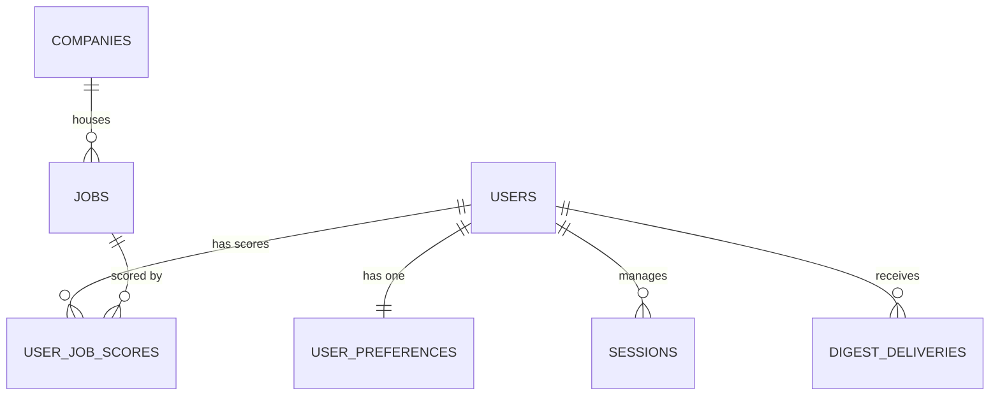

# Multi-User Support Implementation Plan

This document outlines the blueprint and step-by-step workflow to transition `opportunity-radar` from a single-tenant, self-hosted tool to a multi-tenant application supporting registration, profiles, custom scoring, and personalized daily digests.

> [!IMPORTANT]
> The database migration must cleanly separate **global data** (scraped jobs, companies) from **user-specific data** (profile settings, individual job scores, session states, and digest deliveries).

---

## 1. Architectural Overview

The scrapers will remain global, fetching job postings and company data once to avoid rate limits and save bandwidth. However, job scores, user profiles, session tokens, and daily digest configurations will be tied directly to a specific user.



---

## 2. Database Schema Changes

We need to add tables for users and sessions, transform the single-row `app_settings` into a multi-row `user_preferences` table, and migrate the job scores to a user-specific association table.

### DDL Migration Code (Up Migration)

```sql
-- 1. Create Users Table
CREATE TABLE users (
    id BIGSERIAL PRIMARY KEY,
    email TEXT NOT NULL UNIQUE,
    password_hash TEXT NOT NULL,
    created_at TIMESTAMP WITH TIME ZONE NOT NULL DEFAULT NOW(),
    updated_at TIMESTAMP WITH TIME ZONE NOT NULL DEFAULT NOW()
);

-- 2. Create Sessions Table
CREATE TABLE sessions (
    token TEXT PRIMARY KEY,
    user_id BIGINT NOT NULL REFERENCES users(id) ON DELETE CASCADE,
    expires_at TIMESTAMP WITH TIME ZONE NOT NULL,
    created_at TIMESTAMP WITH TIME ZONE NOT NULL DEFAULT NOW()
);

-- 3. Rename app_settings to user_preferences and link to users
ALTER TABLE app_settings RENAME TO user_preferences;
ALTER TABLE user_preferences DROP CONSTRAINT IF EXISTS app_settings_id_check;
ALTER TABLE user_preferences RENAME COLUMN id TO user_id;
ALTER TABLE user_preferences ADD CONSTRAINT fk_user_preferences_user FOREIGN KEY (user_id) REFERENCES users(id) ON DELETE CASCADE;
ALTER TABLE user_preferences ADD CONSTRAINT unique_user_preferences_user_id UNIQUE (user_id);

-- 4. Create User Job Scores Table
CREATE TABLE user_job_scores (
    user_id BIGINT NOT NULL REFERENCES users(id) ON DELETE CASCADE,
    job_id BIGINT NOT NULL REFERENCES jobs(id) ON DELETE CASCADE,
    score DOUBLE PRECISION NOT NULL DEFAULT 0,
    created_at TIMESTAMP WITH TIME ZONE NOT NULL DEFAULT NOW(),
    updated_at TIMESTAMP WITH TIME ZONE NOT NULL DEFAULT NOW(),
    PRIMARY KEY (user_id, job_id)
);

-- 5. Update Digest Deliveries to link to users
ALTER TABLE digest_deliveries ADD COLUMN user_id BIGINT REFERENCES users(id) ON DELETE CASCADE;

-- (Optional) If transitioning existing data, we can create a default user and associate records:
-- INSERT INTO users (id, email, password_hash) VALUES (1, 'default@example.com', '$2a$10$xyz...');
-- UPDATE user_preferences SET user_id = 1 WHERE user_id = 1;
-- INSERT INTO user_job_scores (user_id, job_id, score) SELECT 1, id, score FROM jobs;
-- UPDATE digest_deliveries SET user_id = 1 WHERE user_id IS NULL;

-- 6. Clean up constraints and old columns
ALTER TABLE digest_deliveries DROP CONSTRAINT IF EXISTS unique_recipient_digest_date;
ALTER TABLE digest_deliveries ADD CONSTRAINT unique_user_digest_date UNIQUE (user_id, digest_date);
ALTER TABLE digest_deliveries DROP COLUMN recipient;

ALTER TABLE jobs DROP COLUMN score;
```

---

## 3. Domain & Package-level Changes

### A. Authentication Module (`internal/auth`)
We need to create a new package `internal/auth` to handle authentication, password hashing, and session verification.
*   **Structs**: `User`, `Session`.
*   **Service Methods**:
    *   `Register(ctx, email, password) (*User, error)` - hashes passwords using `bcrypt`.
    *   `Login(ctx, email, password) (*Session, error)` - validates credentials and generates a secure session token.
    *   `Logout(ctx, token) error` - invalidates the session.
    *   `Authenticate(ctx, token) (*User, error)` - retrieves the user for a valid session token.
*   **Middleware**:
    *   `RequireAuth` - intercepts HTTP requests, extracts the session token from a secure, HTTP-only cookie, and saves the authenticated user context to `r.Context()`.

### B. Preferences Module (`internal/preferences`)
Currently, [service.go](file:///home/francis/projects/my-repos/opportunity-radar/internal/preferences/service.go) assumes a single row.
*   Update [Settings](file:///home/francis/projects/my-repos/opportunity-radar/internal/preferences/model.go#L5) struct to replace `ID` with `UserID`.
*   Update [Get](file:///home/francis/projects/my-repos/opportunity-radar/internal/preferences/service.go#L24) and [Save](file:///home/francis/projects/my-repos/opportunity-radar/internal/preferences/service.go#L41) method signatures to accept `userID int64`:
    ```go
    Get(ctx context.Context, userID int64) (*Settings, error)
    Save(ctx context.Context, userID int64, settings *Settings) error
    ```

### C. Jobs Module (`internal/jobs`)
Job scoring must be decoupled from the [jobs.Job](file:///home/francis/projects/my-repos/opportunity-radar/internal/jobs/model.go#L22) model:
*   Remove the `Score` field from the main job model.
*   Add a user-specific join method or custom filter:
    ```go
    type JobWithScore struct {
        jobs.Job
        Score float64
    }
    ```
*   Update [List](file:///home/francis/projects/my-repos/opportunity-radar/internal/jobs/postgres.go#L227) in the repository to join with `user_job_scores` for the active `userID`, sorting by the user-specific score.
*   Introduce `SaveUserScore(ctx, userID, jobID, score)` and `UpdateUserScore(ctx, userID, jobID, score)` methods.

### D. Ingest & Scoring Modules
Ingestion fetches jobs globally, but scoring is run per-user:
*   Update [pipeline.go](file:///home/francis/projects/my-repos/opportunity-radar/internal/ingest/pipeline.go):
    *   When a job is successfully ingested and saved globally, the pipeline queries all active users who have completed their onboarding.
    *   It loops over each user, loads their scoring profile, evaluates the job, and saves the user-specific score in `user_job_scores` using the job service.
*   *Note*: When a user updates their profile settings, the system should trigger a background task to re-evaluate scores for all active jobs for that specific user.

### E. Scheduler & Digest Modules
*   **Global Ingest**: The scheduler still executes scraper tasks globally once every interval.
*   **Per-User Digests**: After global ingestion completes, [runner.go](file:///home/francis/projects/my-repos/opportunity-radar/internal/digest/runner.go) will iterate through all users who have `digest_enabled = true` and `setup_complete = true` on their profiles.
*   For each user, it generates their personalized digest using their own lookback window and `TopN` limit, then sends it to their account email using the Resend sender.

---

## 4. UI & HTTP Route Changes

We will introduce authentication forms, restrict settings routes, and secure the admin UI.

### Web Server Router Setup ([internal/preferences/routes.go](file:///home/francis/projects/my-repos/opportunity-radar/internal/preferences/routes.go))

*   **Public Routes**:
    *   `GET /login` & `POST /login` - User Login Page
    *   `GET /register` & `POST /register` - Registration Page
*   **Private Routes** (Wrapped with `RequireAuth` middleware):
    *   `GET /` - Dashboard showing the user's top scored jobs.
    *   `GET /setup` - Onboarding flow for new users.
    *   `GET /settings/profile` & `/settings/profile/edit` - Custom keywords and target job setup.
    *   `GET /settings/digest` - Individual digest configuration.
    *   `POST /logout` - Invalidate session cookie.

---

## 5. Step-by-Step Implementation Timeline

```
+-----------------------------------+
|  Phase 1: DB Migration            | -> Create users, sessions, user_job_scores
+-----------------------------------+
                  |
                  v
+-----------------------------------+
|  Phase 2: Authentication Layer    | -> Implement password hashing & cookie sessions
+-----------------------------------+
                  |
                  v
+-----------------------------------+
|  Phase 3: Domain Decoupling       | -> Adjust jobs, scoring, and preferences per user
+-----------------------------------+
                  |
                  v
+-----------------------------------+
|  Phase 4: Ingest & Digest Loop    | -> Update scraper pipeline & per-user email runs
+-----------------------------------+
                  |
                  v
+-----------------------------------+
|  Phase 5: UI Integration          | -> Add login/signup forms and secure route handlers
+-----------------------------------+
```

1.  **Phase 1**: Write the DDL migration file to structure tables and relations.
2.  **Phase 2**: Implement `internal/auth` with cookie-based session tracking and password encryption.
3.  **Phase 3**: Refactor `internal/jobs` and `internal/preferences` to require a `userID` parameter.
4.  **Phase 4**: Update [pipeline.go](file:///home/francis/projects/my-repos/opportunity-radar/internal/ingest/pipeline.go) and [runner.go](file:///home/francis/projects/my-repos/opportunity-radar/internal/digest/runner.go) to run per-user scoring and email delivery.
5.  **Phase 5**: Create templates for login and registration, and update the layout header to support logouts.

---

## 6. Open Questions & Architectural Decisions

Before starting the implementation, the following decisions must be addressed to align the development with user requirements and operational preferences.

### A. Authentication & Registration Policy
*   **Question**: Should registration be open to any user, or restricted?
*   **Options/Trade-offs**:
    *   *Open Registration*: Easy onboarding for initial users, but exposes resources to the public.
    *   *Restricted Registration*: Whitelisting domains (e.g. only `@yourcompany.com`), using invite tokens, or disabling registration after the first admin setup.

### B. Outgoing Email Credentials (Resend)
*   **Question**: How should email outgoing settings be managed in a multi-user context?
*   **Options/Trade-offs**:
    *   *Global Credentials*: All users use the same SMTP/Resend API key configured in `.env`. Convenient for small groups, but outgoing email addresses/identity must be centrally managed.
    *   *Per-user Credentials*: Allow users to input their own Resend API Key or SMTP credentials in their profiles.

### C. Job Scoring Method (Push vs. Pull)
*   **Question**: When and how should job scores be calculated?
*   **Options/Trade-offs**:
    *   *Push Model (Pre-computed)*: On job ingestion, compute and persist the score for all users. This makes querying and pagination fast, but writes scale with the number of active users.
    *   *Pull Model (On-the-fly)*: Calculate scores dynamically in memory when listing jobs or running digests. Eliminates the `user_job_scores` table, but may cause performance overhead as database volume increases.

### D. Scraper Scheduling & Scraper Control
*   **Question**: Should the scheduled scrape remain a single global runner, or should each user manage their own schedules?
*   **Details to resolve**:
    *   *Personal Scraper Schedules*: Allow users to customize their scrape frequency (e.g., daily, weekly, every few days) and select which websites to scrape (e.g., only Remotive, only Fuzu, or all).
    *   *Opt-out Option*: Allow users to disable automated scheduled scraping entirely on their accounts and rely purely on manual runs via the UI (using a "Run Once" trigger).
    *   *Impact on Global Scraping*: If users select custom schedules and sites, how should we translate this to the scrapers? (e.g., do we run scrapers on-demand, or keep one global scheduler and simply filter/schedule user-specific digest runs accordingly?)

### E. User-Specific Jobs & Companies
*   **Question**: Should jobs and companies be completely isolated per user, or shared globally with user-specific relationships?
*   **Details to resolve**:
    *   *Isolated Domain Data*: Currently, the `companies` table is global, allowing cross-source identity matching. However, if companies and jobs are only relevant to the user who scraped them, should they be tenant-specific?
    *   *Company Relevance Scoring*: Since the operator uses companies as a long-term outreach list, how should we represent company relevance in the UI? 
        *   *Proposed heuristic*: Aggregate job relevance scores for each company (e.g., sort companies by the maximum, average, or count of their highly-scored jobs) so the operator can prioritize outreach based on historical alignment.

